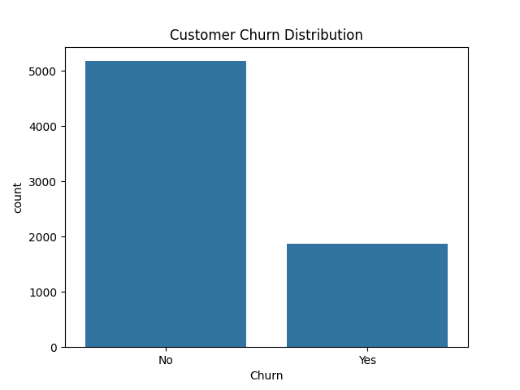
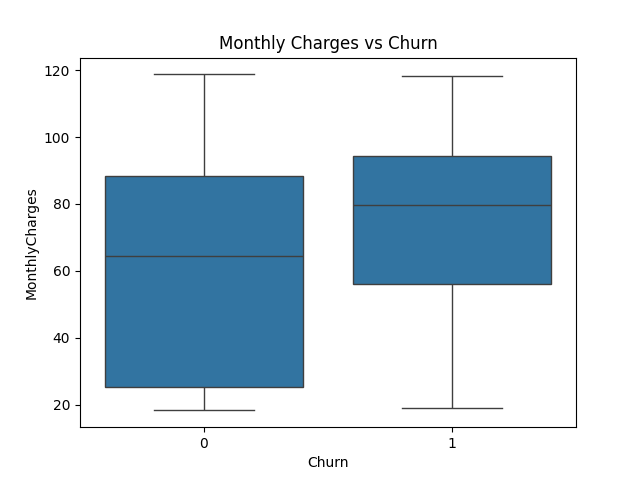
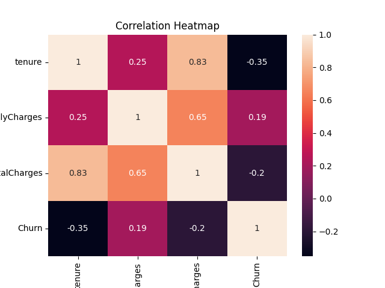
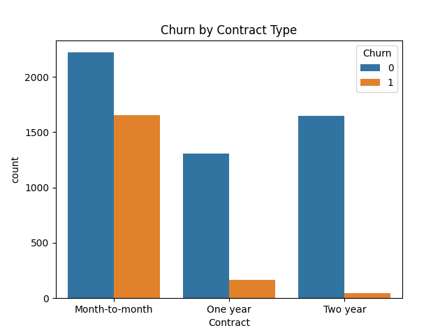

# 📊 Telco Customer Churn Analysis

This project analyzes **customer churn** for a telecommunications company using Python and Machine Learning.  
The objective is to identify key factors influencing churn and predict customers at risk of leaving.

---

## 🧠 Project Overview
- **Goal:** Predict customer churn using demographic and service usage data.  
- **Dataset:** `WA_Fn-UseC_-Telco-Customer-Churn.csv`  
- **Accuracy:** ~80%  
- **Algorithm Used:** Logistic Regression  
- **Visualizations:**  
  - Churn distribution  
  - Monthly charges vs churn  
  - Correlation heatmap  
  - Churn by contract type  

---

## 🛠️ Tools & Technologies
- **Language:** Python  
- **Libraries:** Pandas, NumPy, Matplotlib, Seaborn, Scikit-learn  
- **Environment:** Visual Studio Code (VS Code)  
- **Operating System:** macOS (Apple MacBook Air M2)  

---

## 📈 Results
The model achieved **~80% accuracy** in predicting customer churn.  

**Visualizations Generated:**
-   
-   
-   
-   

These plots highlight important trends and relationships in the dataset.

---

## 💡 Key Insights
- Customers with **month-to-month contracts** have a higher churn rate.  
- **Electronic check payments** correlate with higher churn.  
- Customers with **higher monthly charges** tend to churn more frequently.  
- **Longer tenure** indicates lower churn probability.  

---

## 🚀 How to Run the Project

### 1️⃣ Clone the Repository
```bash
git clone https://github.com/kuldeepsingh343/Telco-Customer-Churn.git
2️⃣ Navigate to the Project Folder
bash
Copy code
cd Telco-Customer-Churn
3️⃣ Install Required Libraries
Make sure you have Python 3 installed. Then, run:

bash
Copy code
pip install pandas numpy matplotlib seaborn scikit-learn
4️⃣ Run the Script
bash
Copy code
python3 churn_analysis.py
After running, all charts will be saved as PNG files in the project folder.

📂 Project Structure
bash
Copy code
Telco-Customer-Churn/
│
├── churn_analysis.py                  # Main analysis script
├── WA_Fn-UseC_-Telco-Customer-Churn.csv  # Dataset
├── churn_distribution.png              # Visualization 1
├── monthly_charges_vs_churn.png        # Visualization 2
├── correlation_heatmap.png             # Visualization 3
├── churn_by_contract.png               # Visualization 4
└── README.md                           # Project documentation

👨‍💻 Author

Kuldeep Singh
🎓 Master of Information Systems | DePaul University
📍 Chicago, IL, USA

LinkedIn: [https://www.linkedin.com/in/kuldeepsingh343/]

YouTube: [https://www.youtube.com/@analyticalresolutions9005]

GitHub: [https://github.com/kuldeepsingh343]

Kaggle: [https://www.kaggle.com/kuldeepsingh343]


⭐ If you find this project helpful, please give it a star on GitHub!